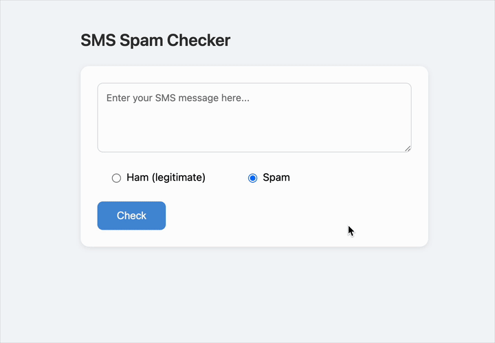
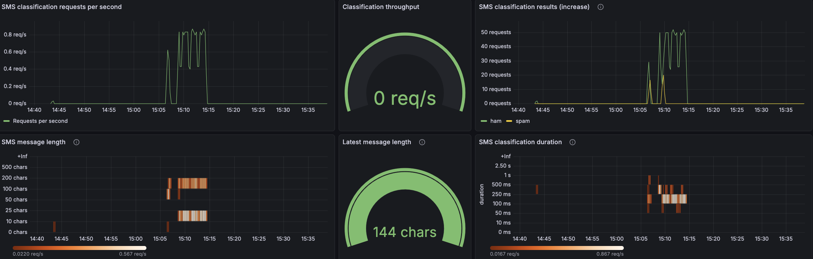
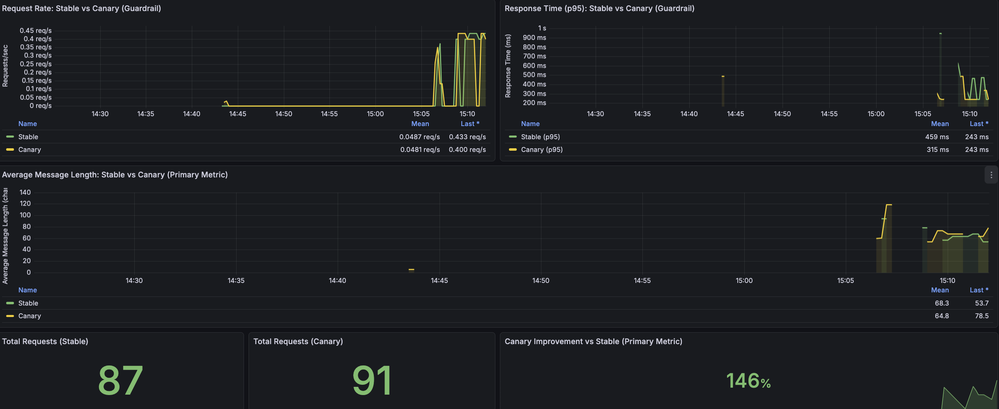

# SMS Checker Operations
 Deployment and infrastructure configurations for the SMS Spam Checker - a machine learning application that classifies text messages as spam or legitimate (ham).

## Related repositories

| Repository | Description | Tech Stack |
|------------|-------------|------------|
| [**app**](https://github.com/doda25-team2/app) | Frontend web application | Spring Boot + Thymeleaf |
| [**model-service**](https://github.com/doda25-team2/model-service) | ML inference service | Python |
| [**lib-version**](https://github.com/doda25-team2/lib-version) | Shared utilities and version management | Java |


## Table of Contents

- [Getting Started](#getting-started)
- [Local Development](#local-development)
  - [Quick Start with Docker Compose](#quick-start-with-docker-compose)
  - [Customizing Images](#customizing-images)
- [Production Deployment (Kubernetes)](#production-deployment-kubernetes)
  - [Option 1: Vagrant (Full 3-node cluster)](#option-1-vagrant-full-3-node-cluster)
  - [Option 2: Minikube (Lightweight local cluster)](#option-2-minikube-lightweight-local-cluster)
  - [Option 3: Existing Kubernetes Cluster](#option-3-existing-kubernetes-cluster)
- [Understanding the Setup](#understanding-the-setup)
  - [Network Architecture (Vagrant)](#network-architecture-vagrant)
  - [What Gets Installed](#what-gets-installed)
  - [Canary Deployment](#canary-deployment)
- [Monitoring and Metrics](#monitoring-and-metrics)
- [Documentation](#documentation)

---

## Getting Started

First, clone this repository:

```bash
git clone git@github.com:doda25-team2/operation.git sms-checker-operations
cd sms-checker-operations
```

Choose your deployment approach:
- **For local development and testing**: Use [Docker Compose](#quick-start-with-docker-compose) - fastest and simplest
- **For production-like environment**: Use [Kubernetes](#production-deployment-kubernetes) - full observability, service mesh, and monitoring

---

## Local Development

### Quick Start with Docker Compose

The fastest way to run the application locally.

```bash
# Run the containers
docker compose up -d
```

Access the application at http://localhost:8080/sms



To stop: `docker compose down`

### Customizing Images

By default, the compose file uses the latest published images. To override versions:

```bash
cp .env.example .env
# Edit .env to set specific image tags
docker compose up -d
```

---

## Production Deployment (Kubernetes)

### Option 1: Vagrant (Full 3-node cluster)

Creates a complete Kubernetes cluster with Istio, Prometheus, and Grafana. Takes ~10-15 minutes.

**Requirements:**
- Vagrant and VirtualBox installed
- At least 14GB free RAM

**Steps:**

```bash
# Start the cluster
vagrant up

# Set up kubectl access from your host
export KUBECONFIG=$(pwd)/admin.conf

# Verify the cluster
kubectl get nodes

# Deploy the application
helm upgrade --install operation ./deployment

# Add to /etc/hosts:
# 192.168.56.95   sms-checker.local
# 192.168.56.95   grafana.local
# 192.168.56.95   dashboard.local
```

**Access the application:**
- App: http://sms-checker.local/sms
- Grafana: http://grafana.local (admin/admin)
- Kubernetes Dashboard: https://dashboard.local

**Note:** When visiting the app in a browser, you'll see the **stable version**. To test the canary version, send requests with the `x-user-id` header (see Canary Deployment section below).

**AlertManager** (NodePort only - find the port):
```bash
kubectl get svc operation-kube-prometheus-alertmanager -n default
# Then access: http://192.168.56.100:<PORT>
```

**Kubernetes Dashboard login:**
```bash
# Get a token
vagrant ssh ctrl --command "kubectl -n kubernetes-dashboard create token admin-user"

# Then visit https://dashboard.local and paste the token
```

### Option 2: Minikube (Lightweight local cluster)

**Requirements:**
- Minikube, kubectl, and Helm installed
- Docker running

**Steps:**

```bash
# Start Minikube
minikube start --driver=docker --cni=calico
minikube addons enable ingress

# Install Istio
curl -L https://istio.io/downloadIstio | ISTIO_VERSION=1.25.2 sh -
istio-1.25.2/bin/istioctl install -y

# Deploy the app
helm upgrade --install operation ./deployment

# Add to /etc/hosts:
# 127.0.0.1 sms-checker.local

# Start the tunnel (keep running in a separate terminal)
minikube tunnel
```

Access at http://sms-checker.local

### Option 3: Existing Kubernetes Cluster

If you already have a Kubernetes cluster with Istio installed:

```bash
helm upgrade --install operation ./deployment
```

Make sure to configure your DNS or /etc/hosts to point the application hostname to your Istio Ingress Gateway IP.

---

## Understanding the Setup

### Network Architecture (Vagrant)

When using Vagrant, you get 3 VMs:
- `ctrl` (192.168.56.100) - Kubernetes control plane
- `node-1` (192.168.56.101) - Worker node
- `node-2` (192.168.56.102) - Worker node

The Istio Ingress Gateway gets assigned IP `192.168.56.95` by MetalLB. This is why you add `192.168.56.95 sms-checker.local` to your hosts file.

### What Gets Installed

The Vagrant provisioning automatically installs:
- Kubernetes (kubeadm, kubelet, kubectl)
- Flannel (pod networking)
- MetalLB (load balancer)
- Nginx Ingress Controller
- Istio service mesh
- Kubernetes Dashboard

The Helm chart (`./deployment`) installs:
- Application and model service deployments
- Istio traffic management (Gateway, VirtualService, DestinationRule)
- Prometheus and Grafana (via kube-prometheus-stack)
- Custom dashboards and alerts

### Canary Deployment

The application uses Istio for A/B testing. Traffic is routed based on the `x-user-id` header:
- User IDs ending in "0" go to the **canary version** (~10%)
- All other IDs go to the **stable version** (~90%)
- Browser visits (no header) default to **stable version**

**Current versions:**
- Stable: `ghcr.io/doda25-team2/app:latest`
- Canary: `ghcr.io/doda25-team2/app:v1.3.1`

Test different versions:
```bash
# Stable version
curl -H "x-user-id: user123" http://sms-checker.local/sms

# Canary version (ID ends in 0)
curl -H "x-user-id: user0" http://sms-checker.local/sms
```

---

## Monitoring and Metrics

The app exposes custom Prometheus metrics at `/metrics`:
- `sms_classification_requests_total` - Total requests
- `sms_classification_results_total{result}` - Results by type (spam/ham)
- `sms_current_message_length_chars` - Current message length
- `sms_classification_duration_milliseconds` - Response times
- `sms_message_length_chars` - Message length distribution

View these in Grafana at http://grafana.local (credentials: admin/admin).

Main dashboards:
- SMS metrics


- A4 Experiment: Stable vs Canary

For experiment results you can refer to [docs/continuous-experimentation.md](./docs/continuous-experimentation.md)

**Troubleshooting:** If Grafana shows "Prometheus datasource not found":
1. Go to Configuration → Data sources
2. Click "Add data source" → select "Prometheus"
3. URL: `http://operation-kube-prometheus-prometheus.default:9090`
4. Access: Server (default)
5. Click "Save & Test"

This can happen due to a race condition where Grafana starts before the sidecar provisions the datasource.

---

## Documentation

For detailed architecture and design information, see:
- [docs/deployment.md](./docs/deployment.md) - Complete deployment architecture
- [docs/continuous-experimentation.md](./docs/continuous-experimentation.md) - A/B testing setup
- [docs/extension.md](./docs/extension.md) - Proposed improvements
