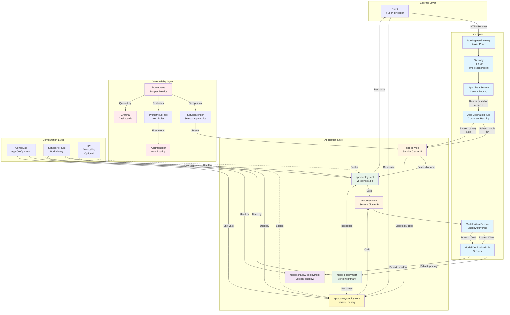

# Deployment Documentation

This project deploys an SMS classification web application on Kubernetes using an **Istio service mesh** for **traffic management** and **continuous experimentation**. The system consists of two microservices—**app-service** and **model-service**—and uses Istio to (1) expose the application via an **Istio IngressGateway**, (2) route users deterministically to a canary app variant, and (3) run a **shadow launch** of the model-service by mirroring traffic.

Istio is used to:
- Expose the application through an **Istio IngressGateway** (Gateway + VirtualService).
- Route requests to **app-service stable** or **app-service canary** based on the `x-user-id` request header.
- Stabilize routing for a user via **consistent hashing** on `x-user-id` (sticky behavior).
- Mirror model traffic to a **shadow** model-service instance to evaluate a new model version without affecting user-visible responses.

---

## Deployed Components

The complete deployment architecture, including all Kubernetes and Istio resources and their relationships, is visualized in the [Deployment Architecture](#deployment-architecture) diagram below.

### Application Services

#### app-service
- Two variants (as Istio subsets):
  - **stable**: baseline version (`version: stable`)
  - **canary**: experimental version (`version: canary`)
- Serves the UI and exposes API endpoints (e.g., `/predict`).
- Calls the model service at a single in-cluster DNS name: `http://model-service:8081`.
- Exposes Prometheus metrics at `/metrics` (scraped via ServiceMonitor).

#### model-service
- Two variants (as Istio subsets):
  - **primary**: user-visible model version (`version: primary`)
  - **shadow**: shadow model version (`version: shadow`)
- Shadow variant is deployed as a separate Deployment (labeled `version: shadow`).
- Shadow is not user-visible; it receives mirrored traffic for evaluation.

### Deployment Architecture

The following diagram illustrates the complete deployment architecture, showing all Kubernetes and Istio resources and their relationships:

This architecture diagram shows:
- **Istio Layer**: Gateway, VirtualServices, and DestinationRules that manage traffic routing
- **Application Layer**: Services and Deployments for both app-service (stable/canary) and model-service (primary/shadow)
- **Observability Layer**: Prometheus stack components for metrics collection, visualization, and alerting
- **Configuration Layer**: ConfigMap, ServiceAccount, and optional HPA for application configuration and scaling

---

## Istio Components

### IngressGateway
- Deployed outside the Helm chart during cluster provisioning.
- Acts as the single north–south entry point into the mesh.
- The gateway selector is configurable via Helm values:
  - `spec.selector.istio: {{ .Values.istio.ingressGateway.name }}`  
  This allows deployment into clusters that use a different IngressGateway naming convention.

### Gateway
- Accepts HTTP traffic on **port 80** for the configured host:
  - `hosts: [ {{ .Values.istio.host }} ]`

### VirtualService (App Ingress)
- Binds to the Gateway and routes incoming requests to app-service.
- Implements deterministic canary routing based on `x-user-id`:
  - Users whose `x-user-id` matches the canary rule are routed to **subset `canary`**.
  - All other users are routed to **subset `stable`**.

> Routing decisions are taken by the **Envoy proxy at the Istio IngressGateway**.

### DestinationRule (app-service)
- Defines subsets:
  - `stable` → pods labeled `version: stable`
  - `canary` → pods labeled `version: canary` (when enabled)
- Implements sticky routing support via consistent hashing:
  - `trafficPolicy.loadBalancer.consistentHash.httpHeaderName: x-user-id`  
  This stabilizes routing when the same user repeatedly sends the same `x-user-id`.

### DestinationRule + VirtualService (model-service shadow launch)
- DestinationRule defines model subsets:
  - `primary` → pods labeled `version: primary`
  - `shadow` → pods labeled `version: shadow`
- VirtualService for model-service routes:
  - **100%** of requests to subset **primary** (user-visible responses)
  - **mirrors 100%** of the traffic to subset **shadow** (shadow evaluation)

This realizes a **shadow launch**: the shadow model processes the same inputs, but its outputs are not returned to users.

---

## Observability

### Prometheus
- Scrapes app-service metrics from `/metrics`.
- App metrics are discovered via a **ServiceMonitor** selecting the app-service labels.
- Evaluates alerting rules (PrometheusRule), including:
  - `HighRequestRate` when request rate exceeds a threshold for a sustained period.

### Grafana
- Queries Prometheus for dashboards and comparisons between app variants.
- Supports experiment monitoring by visualizing request rate, latency, and classification outcomes.

### Alertmanager
- Receives firing alerts from Prometheus and exposes alert state via its UI.
- Can be configured to forward alerts to external receivers (webhook integrations).

---

## External Access

### Hostnames
- `sms-checker.local` – primary entry point (configured as `.Values.istio.host`)

### Ports
- HTTP **80**, exposed via the Istio IngressGateway

### Paths
- `/` – frontend web application
- `/predict` – prediction endpoint (served by app-service)
- `/metrics` – Prometheus metrics endpoint (served by app-service)

### Headers
- `x-user-id` – used for deterministic canary routing and sticky behavior

### Authentication
- No authentication is required (local experimental setup).

---

## Request Flow

### Typical Request Path (UI / Predict)

The request flow follows these steps (see the [Request Data Flow](#request-data-flow) diagram below for a visual representation):

1. The client sends an HTTP request to `http://sms-checker.local` (e.g., `/` or `/predict`) with an `x-user-id` header.
2. The request reaches the **Istio IngressGateway (Envoy)**.
3. The **Gateway** admits the request based on host and port.
4. The **App VirtualService** evaluates `x-user-id`:
   - If it matches the canary rule → route to **app-service subset `canary`**
   - Otherwise → route to **app-service subset `stable`**
5. The selected app-service instance calls the model via `http://model-service:8081`.
6. The **Model VirtualService** routes the request:
   - Response path → **model-service subset `primary`**
   - Shadow evaluation → **mirrors** the same request to **subset `shadow`**
7. The user receives the response from **primary**; shadow is evaluated asynchronously (no user-visible impact).
8. Prometheus scrapes app-service metrics via `/metrics`; Grafana visualizes them; PrometheusRule can trigger alerts.

### Request Data Flow

The following sequence diagram illustrates the complete request flow from client to services, including routing decisions and shadow mirroring:

Key routing decisions are made at three points:
1. **IngressGateway (Envoy)**: Validates and admits requests based on Gateway configuration
2. **App VirtualService**: Evaluates `x-user-id` header to route to canary (~10%) or stable (~90%) subset
3. **Model VirtualService**: Routes 100% to primary (user-visible) and mirrors 100% to shadow (evaluation only)

The canary routing split (90/10) is determined by the regex pattern `.*0$` matching user IDs ending in "0", which represents approximately 10% of users when IDs are uniformly distributed.

---

## Canary Routing and Sticky Sessions

Canary routing is implemented in the **VirtualService bound to the Gateway** and uses `x-user-id` to deterministically select the canary subset. Sticky behavior is supported via **consistent hashing** on `x-user-id` in the app-service DestinationRule, ensuring that repeated requests with the same identifier are routed consistently.

The routing decision is taken by **Envoy at the Istio IngressGateway**, not by application code. See the [Canary Routing Decision Flow](#canary-routing-decision-flow) diagram below for a detailed visualization of the routing logic.

### Canary Routing Decision Flow

The following flowchart details the canary routing logic and decision points:

This diagram shows:
- **Decision Point 1**: Gateway validates the request (host and port matching)
- **Decision Point 2**: App VirtualService evaluates the `x-user-id` header using regex pattern `.*0$` to determine canary routing
- **Routing Split**: Approximately 10% of users (those with IDs ending in "0") are routed to canary, while 90% go to stable
- **Sticky Sessions**: The DestinationRule applies consistent hashing on `x-user-id`, ensuring the same user ID always routes to the same pod within a subset
- **Location**: All routing decisions are made by the Envoy proxy at the Istio IngressGateway, not by application code

---

## Additional Istio Use Case: Shadow Launch (Model)

The deployment implements a **shadow launch** for the model-service:
- All user-visible model responses are served by **subset `primary`**.
- Identical traffic is mirrored to **subset `shadow`** using Istio’s `mirror` feature.
- This makes it possible to evaluate a newer model version under real traffic without impacting users.

The [Shadow Launch Architecture](#shadow-launch-architecture) diagram below illustrates how traffic is mirrored and processed.

### Shadow Launch Architecture

The following diagram illustrates the shadow launch pattern for model-service traffic mirroring:

This diagram demonstrates:
- **100% Traffic to Primary**: All requests are routed to the primary subset, which generates user-visible responses
- **100% Mirroring to Shadow**: The same requests are mirrored (copied) to the shadow subset for evaluation
- **Asynchronous Processing**: The shadow processes requests asynchronously; its responses are discarded and never returned to users
- **Zero User Impact**: Users only see responses from the primary model, while the shadow model is evaluated under real traffic conditions
- **Evaluation Benefits**: This pattern allows testing new model versions with production traffic patterns without risking user experience

The mirroring is configured in the Model VirtualService with `mirrorPercentage: 100`, ensuring every request to the primary is also sent to the shadow for evaluation.
