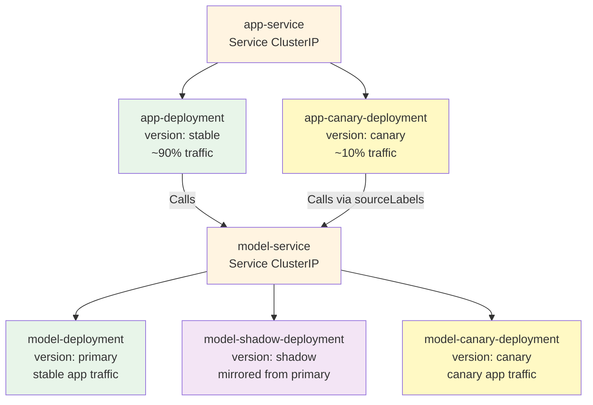
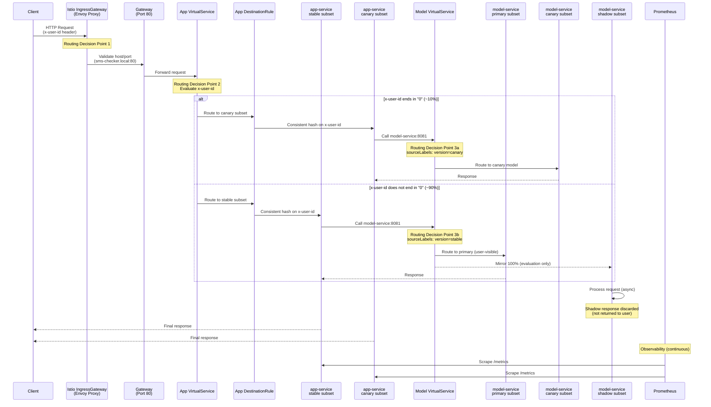
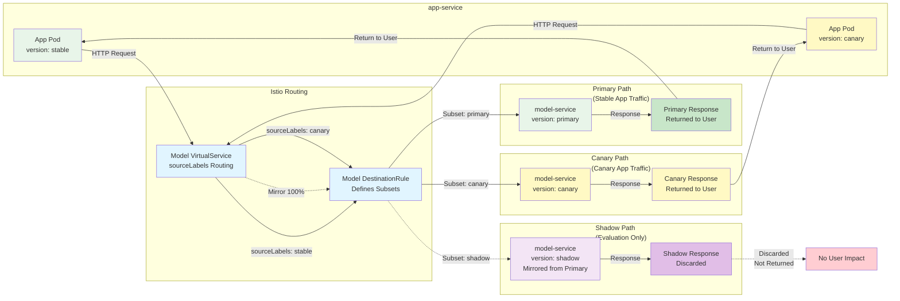

# Deployment Documentation

This project deploys an SMS classification web application on Kubernetes using an **Istio service mesh** for **traffic management** and **continuous experimentation**. The system consists of two microservices—**app-service** and **model-service**—and uses Istio to (1) expose the application via an **Istio IngressGateway**, (2) route users deterministically to a canary app variant, and (3) run a **shadow launch** of the model-service by mirroring traffic.

Istio is used to:
- Expose the application through an **Istio IngressGateway** (Gateway + VirtualService).
- Route requests to **app-service stable** or **app-service canary** based on the `x-user-id` request header.
- Stabilize routing for a user via **consistent hashing** on `x-user-id` (sticky behavior).
- Mirror model traffic to a **shadow** model-service instance to evaluate a new model version without affecting user-visible responses.

---

## Deploying the Kubernetes cluster

To deploy the Kubernetes cluster, run the following command from the `operation` directory:

```bash
vagrant up
```

If the VMs take too long to boot, you can increase the timeout by setting the `BOOT_TIMEOUT` environment variable (default is 300 seconds). It might also help to open Oracle VirtualBox Manager and to click on each VM to see its boot progress. For example, to set a timeout of 600 seconds, run:

```bash
BOOT_TIMEOUT=600 vagrant up
```

To tear down the cluster, run:

```bash
vagrant destroy --force
```

### Deploying on Windows hosts

If using Windows as the host OS, ensure that you have [WSL2](https://docs.microsoft.com/en-us/windows/wsl/install) installed and configured, and that you are using the [mirrored networking mode](https://learn.microsoft.com/en-us/windows/wsl/networking#mirrored-mode-networking). This is only available in Windows 11. Then, run the following command from a WSL2 terminal to configure Vagrant to access Windows files and VirtualBox:

```bash
export VAGRANT_WSL_ENABLE_WINDOWS_ACCESS="1"
export VAGRANT_WSL_WINDOWS_ACCESS_USER_HOME_PATH="/mnt/c/Users/$(powershell.exe 'Write-Host -NoNewLine $env:UserName')/"
export PATH="$PATH:/mnt/c/Program Files/Oracle/VirtualBox"
export SSH_HOST="127.0.0.1"
```

You can now run `vagrant up` as normal from the WSL2 terminal.

### Applying `finalization.yaml` manually

When the cluster is provisioned, the `finalization.yaml` manifest is already automatically applied. If you need to apply it manually (e.g., after making changes), run:

```bash
ansible-playbook -u vagrant -i 192.168.56.100, ./ansible/finalization.yaml
```

Or if using WSL2 on Windows:

```bash
ansible-playbook -i ./ansible/inventory-wsl.ini ./ansible/finalization.yaml
```

> [!CAUTION]
> TODO: Check if this is still needed after https://github.com/doda25-team2/operation/pull/95 is merged

## Deploying the application in Minikube

> [!NOTE]
> Using Minikube is intended for local development and testing only. For production deployments, use the Vagrant-based Kubernetes cluster as described above.

To facilitate local development and testing, you can deploy the application on a Minikube cluster. Make sure you have [Minikube](https://minikube.sigs.k8s.io/docs/start/), [Helm](https://helm.sh/docs/intro/install/), and [kubectl](https://kubernetes.io/docs/tasks/tools/) installed and ensure your [Docker daemon is running](https://docs.docker.com/get-docker/).

1. Start Minikube with the Calico CNI plugin and enable the necessary addons:

   ```bash
   minikube start --driver=docker --cni=calico
   minikube addons enable ingress
   ```

2. Download `istioctl` from the [Istio releases page](https://github.com/istio/istio/releases) and install Istio in your Minikube cluster:

   ```bash
   istioctl install -y
   ```

   > [!NOTE]
   > It is possible to skip this step if you don't want to test any Istio-specific features,    but you'll have to run the following command to configure the Ingress NGINX controller    service as a LoadBalancer instead of NodePort:
   > ```bash
   > kubectl patch svc ingress-nginx-controller -n ingress-nginx -p '{"spec": {"type":    "LoadBalancer"}}'
   > ```

3. Deploy the application Helm chart:

   ```bash
   helm install deployment ./deployment
   ```

4. Add the following entry to your `/etc/hosts` file to map the application hostname to the loopback address:

   ```
   127.0.0.1 sms-checker.local
   127.0.0.1 grafana.local
   ```

5. Wait for the pods to be in the `Running` state:

   ```bash
   kubectl get pods
   ```

6. To access the application, run the following command to create a tunnel for the LoadBalancer service:

   ```bash
   minikube tunnel
   ```

7. Access the application at http://sms-checker.local.


## Deploying the application on an existing Kubernetes cluster

To deploy the application on an existing Kubernetes cluster, ensure that you have [Helm](https://helm.sh/docs/intro/install/) and [kubectl](https://kubernetes.io/docs/tasks/tools/) installed and configured to access your cluster.

The cluster must have Istio installed and an Istio IngressGateway configured. See [istio-operator.yaml](./../k8s/istio-operator.yaml) for an example Istio installation manifest.

1. Deploy the application Helm chart:

   ```bash
   helm install deployment ./deployment
   ```

2. Add the following entry to your DNS or `/etc/hosts` file to map the application hostname to the appropriate IP address of your Istio IngressGateway:

   ```
   <INGRESS_GATEWAY_IP> sms-checker.local
   <INGRESS_GATEWAY_IP> grafana.local
   ```

   Replace `<INGRESS_GATEWAY_IP>` with the actual IP address of your Istio IngressGateway.

3. Wait for the pods to be in the `Running` state:

   ```bash
   kubectl get pods
   ```

4. Access the application at http://sms-checker.local.

## Deployed Components

The complete deployment architecture, including all Kubernetes and Istio resources and their relationships, is visualized in the [Deployment Architecture](#deployment-architecture) diagram below.

### Application Services

#### app-service
- Two variants (as Istio subsets):
  - **stable**: baseline version (`version: stable`)
  - **canary**: experimental version (`version: canary`)
- Serves the UI and exposes API endpoints (e.g., `/predict`).
- Calls the model service at a single in-cluster DNS name: `http://model-service:8081`.
- Exposes Prometheus metrics at `/metrics` (scraped via ServiceMonitor).

#### model-service
- Three variants (as Istio subsets):
  - **primary**: user-visible model version (`version: primary`)
  - **shadow**: shadow model version (`version: shadow`)
  - **canary**: experimental model version (`version: canary`)
- Shadow variant is deployed as a separate Deployment (labeled `version: shadow`).
- Shadow is not user-visible; it receives mirrored traffic for evaluation.
- Canary model receives traffic only from canary app pods (via `sourceLabels` routing).

### Deployment Architecture

The deployment architecture is organized into several layers. The following diagrams break down the system into focused modules:

#### High-Level System Overview


#### Istio Traffic Management Layer


#### Application Services and Deployments



#### Observability Stack


#### Configuration Resources


These modular diagrams show:
- **High-Level Overview**: The main architectural layers and their relationships
- **Istio Traffic Management**: Gateway, VirtualServices, and DestinationRules that handle routing
- **Application Services**: Services and Deployments with their traffic distribution (90/10 canary, 100% primary + shadow mirroring)
- **Observability Stack**: Prometheus, Grafana, and Alertmanager for monitoring and alerting
- **Configuration Resources**: ConfigMap, ServiceAccount, and optional HPA for application configuration and scaling

---

## Istio Components

### IngressGateway
- Deployed outside the Helm chart during cluster provisioning.
- Acts as the single north–south entry point into the mesh.
- The gateway selector is configurable via Helm values:
  - `spec.selector.istio: {{ .Values.istio.ingressGateway.name }}`  
  This allows deployment into clusters that use a different IngressGateway naming convention.

### Gateway
- Accepts HTTP traffic on **port 80** for the configured host:
  - `hosts: [ {{ .Values.istio.host }} ]`

### VirtualService (App Ingress)
- Binds to the Gateway and routes incoming requests to app-service.
- Implements deterministic canary routing based on `x-user-id`:
  - Users whose `x-user-id` matches the canary rule are routed to **subset `canary`**.
  - All other users are routed to **subset `stable`**.

> Routing decisions are taken by the **Envoy proxy at the Istio IngressGateway**.

### DestinationRule (app-service)
- Defines subsets:
  - `stable` → pods labeled `version: stable`
  - `canary` → pods labeled `version: canary` (when enabled)
- Implements sticky routing support via consistent hashing:
  - `trafficPolicy.loadBalancer.consistentHash.httpHeaderName: x-user-id`  
  This stabilizes routing when the same user repeatedly sends the same `x-user-id`.

### DestinationRule + VirtualService (model-service canary + shadow launch)
- DestinationRule defines model subsets:
  - `primary` → pods labeled `version: primary`
  - `shadow` → pods labeled `version: shadow`
  - `canary` → pods labeled `version: canary`
- VirtualService for model-service routes:
  - Requests from pods with `version: canary` label → subset **canary** (no mirroring)
  - All other requests → subset **primary** (user-visible responses)
  - **mirrors 100%** of primary traffic to subset **shadow** (shadow evaluation)

This realizes both a **canary deployment** and a **shadow launch**:
- Canary app pods always communicate with canary model pods (via `sourceLabels` routing)
- Stable app traffic is routed to primary model with shadow mirroring for evaluation

---

## Observability

### Prometheus
- Scrapes app-service metrics from `/metrics`.
- App metrics are discovered via a **ServiceMonitor** selecting the app-service labels.
- Evaluates alerting rules (PrometheusRule), including:
  - `HighRequestRate` when request rate exceeds a threshold for a sustained period.

### Grafana
- Available at `http://grafana.local` with username `admin` and the password specified in [`.kube-prometheus-stack.grafana.adminPassword`](../deployment/values.yaml).
- Queries Prometheus for dashboards and comparisons between app variants.
- Supports experiment monitoring by visualizing request rate, latency, and classification outcomes.

### Alertmanager
- Receives firing alerts from Prometheus and exposes alert state via its UI.
- Can be configured to forward alerts to external receivers (webhook integrations).

---

## External Access

### Hostnames
- `sms-checker.local` – primary entry point (configured as `.Values.istio.host`)

### Ports
- HTTP **80**, exposed via the Istio IngressGateway

### Paths
- `/` – frontend web application
- `/predict` – prediction endpoint (served by app-service)
- `/metrics` – Prometheus metrics endpoint (served by app-service)

### Headers
- `x-user-id` – used for deterministic canary routing and sticky behavior

### Authentication
- No authentication is required (local experimental setup).

---

## Request Flow

### Typical Request Path (UI / Predict)

The request flow follows these steps (see the [Request Data Flow](#request-data-flow) diagram below for a visual representation):

1. The client sends an HTTP request to `http://sms-checker.local` (e.g., `/` or `/predict`) with an `x-user-id` header.
2. The request reaches the **Istio IngressGateway (Envoy)**.
3. The **Gateway** admits the request based on host and port.
4. The **App VirtualService** evaluates `x-user-id`:
   - If it matches the canary rule → route to **app-service subset `canary`**
   - Otherwise → route to **app-service subset `stable`**
5. The selected app-service instance calls the model via `http://model-service:8081`.
6. The **Model VirtualService** routes the request based on `sourceLabels`:
   - If the request originates from a canary app pod (`version: canary`) → route to **model-service subset `canary`** (no mirroring)
   - Otherwise → route to **model-service subset `primary`** + **mirror** to **subset `shadow`**
7. The user receives the response from **primary** or **canary** depending on routing; shadow is evaluated asynchronously (no user-visible impact).
8. Prometheus scrapes app-service metrics via `/metrics`; Grafana visualizes them; PrometheusRule can trigger alerts.

### Request Data Flow

The following sequence diagram illustrates the complete request flow from client to services, including routing decisions and shadow mirroring:



Key routing decisions are made at three points:
1. **IngressGateway (Envoy)**: Validates and admits requests based on Gateway configuration
2. **App VirtualService**: Evaluates `x-user-id` header to route to canary (~10%) or stable (~90%) subset
3. **Model VirtualService**: Uses `sourceLabels` to route based on the calling pod's version label:
   - Requests from canary app pods → model canary subset (no mirroring)
   - Requests from stable app pods → model primary subset + mirror to shadow

The canary routing split (90/10) is determined by the regex pattern `.*0$` matching user IDs ending in "0", which represents approximately 10% of users when IDs are uniformly distributed. This regex is configurable with the [Helm chart value `istio.canary.headerRoutingRegex`](../deployment/values.yaml).

---

## Canary Routing and Sticky Sessions

Canary routing is implemented in the **VirtualService bound to the Gateway** and uses `x-user-id` to deterministically select the canary subset. Sticky behavior is supported via **consistent hashing** on `x-user-id` in the app-service DestinationRule, ensuring that repeated requests with the same identifier are routed consistently.

The routing decision is taken by **Envoy at the Istio IngressGateway**, not by application code. See the [Canary Routing Decision Flow](#canary-routing-decision-flow) diagram below for a detailed visualization of the routing logic.

### Canary Routing Decision Flow

The following flowchart details the canary routing logic and decision points:


This diagram shows:
- **Decision Point 1**: Gateway validates the request (host and port matching)
- **Decision Point 2**: App VirtualService evaluates the `x-user-id` header using regex pattern `.*0$` to determine canary routing
- **Routing Split**: Approximately 10% of users (those with IDs ending in "0") are routed to canary, while 90% go to stable
- **Sticky Sessions**: The DestinationRule applies consistent hashing on `x-user-id`, ensuring the same user ID always routes to the same pod within a subset
- **Location**: All routing decisions are made by the Envoy proxy at the Istio IngressGateway, not by application code

---

## Additional Istio Use Case: Shadow Launch (Model)

The deployment implements a **shadow launch** for the model-service:
- User-visible model responses from **stable app pods** are served by **subset `primary`**.
- Identical traffic is mirrored to **subset `shadow`** using Istio's `mirror` feature.
- Requests from **canary app pods** are routed to **subset `canary`** without shadow mirroring.
- This makes it possible to evaluate a newer model version under real traffic without impacting users.

The [Shadow Launch Architecture](#shadow-launch-architecture) diagram below illustrates how traffic is mirrored and processed.

### Shadow Launch Architecture

The following diagram illustrates the shadow launch pattern for model-service traffic mirroring:



This diagram demonstrates:
- **sourceLabels Routing**: The Model VirtualService uses `sourceLabels` to determine routing based on which app pod version made the request
- **Canary App → Canary Model**: Requests from canary app pods are routed directly to the canary model subset (no mirroring)
- **Stable App → Primary Model + Shadow**: Requests from stable app pods are routed to the primary model with 100% mirroring to shadow
- **Asynchronous Processing**: The shadow processes requests asynchronously; its responses are discarded and never returned to users
- **Zero User Impact**: Users only see responses from the primary or canary model, while the shadow model is evaluated under real traffic conditions
- **End-to-End Canary**: This pattern ensures that canary users experience both canary app AND canary model versions together

The mirroring is configured in the Model VirtualService with `mirrorPercentage: 100`, ensuring every request to the primary (from stable app) is also sent to the shadow for evaluation.
