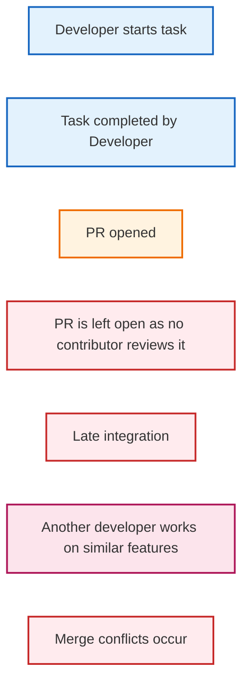
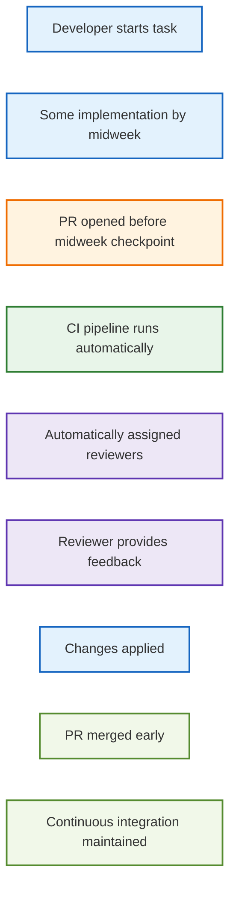

# Extension Proposal: Midweek CI Pipeline and Automated PR Review

## Current State:

Within this project, as a team of 6, the distribution of work and contribution by each contributor is excellent. Most features and steps have been implemented with the highest quality. By following release-engineering practices such as quality descriptions written for each PR ensuring every contributor knows intricate details of the PR and also another contributor reviewing the PR and adding any comments that can improve the PR were done which significantly helped in finishing features for each assignment with high code quality. However, after assignment 1 (so with assignment 2,3 and 4), although every week work as being done but a lot of features were being completed the following week which increases the amount of work that is set to be done.

## Release-Engineering Related Shortcoming:

One of the release-engineering related shortcomings that will be discussed in this extension proposal is the **contribution process** for this project. As mentioned in the current states section, although each contributor has contributed effectively, we do not finish our tasks within the assigned week. The work tends to get completed the following week, which is good, but then for the next assignment the same issue occurs. The reason why this is considered a release-engineering shortcoming is due to the following:

- The contribution process slows down integration in which many features/steps have missed deadlines, increasing the workload. As mentioned in the paper by Fowler [1], the integration hell, which is the late integration by the developers, can cause conflict to be resolved with more difficulty leading to the code being unmerged.
- This can create merge conflicts, which has happened for assignment 2. These merge conflicts can delay further work done by each person which slows work. According to Fowler, the research and industry practice show that infrequent integration increases merge conflicts compared to frequent merges.
- The contribution process can lead to low-quality or inconsistent code.
- Sometimes reviewers don’t review the PRs open, which leads to the problems mentioned above. Code review being done in an orderly manner is prominent for maintaining the code quality, as if not done so, it can slow integration and feedback loops [2].
- This shortcoming is general nature and applicable beyond the project since there have been studies showing that pull-based development system show that delayed pull request integration is one the most common problems no matter the size of the projects. Some form of solution that improves integration timing are useful [3].

Below is a figure which illustartes the current contribution workflow and how missing reviews leads to late integrations and merge conflicts: 

Figure 1: Current Contribution Workflow

## Proposed Extensions

A proposed extension connected to the shortcoming discussed above is the following:

### Implementation of a MidWeek CI checkpoint: 

A mini-deadline can be added every mid-week in order to have some work done and it will be automatically checked. As mentioned above, with a more frequent integration checkpoint, this aligns with the CI and CD principles in which this ensures that the “integration hell” is reduced and the feedback speed improves [1].
### Automated PR Review

Add automation such that it requests reviewers automatically every time a PR is opened.

### Explanation

These extensions will be created through the use of github workflows in which they will be (.github/workflows/midweek.yml) and (.github/workflows/autopr.yml) and theses will be incorporated in all four repositories.

With these extensions to improve the shortcomings, adding automation is excellent as in many companies automation of notifying reviewers every time a PR opens supports a good practice for efficient code reviews [2]. Since this ensures every reviewer is aware that a PR has been opened, it leads to it being merged and there being fewer merging issues. With more frequent integration, this reduces the delays in reviews and the feedback received will be more efficient, which leads to a much better delivery performance. Implementing a midweek PR ensures that every contributor has had the time to think and provide a meanigful contributon rather then procastinate and wait till the end of each week.

Below is figure 2, which demonstrates how the proposed extension will impact the contribution workflow.

Figure 2: Proposed Extensions and its effect on the workflow

## Expected Outcome

The proposed extension will lead to a reduction of late merge integrations in which this will limit the number of merge conflicts and overall ensure no pull requests are left open for long duration. With the mid-week CI checkpoint, the code changes are integrated earlier and limit merge conflicts. The automation to make reviewers check the open PRs improves responsibility and reduces delays [4].

To evaluate the extension, an experiment can be conducted by comparing objective metrics before and after the added extension proposal. Some metrics can be the average pull request, number of merge conflicts in each assignment and the time it took to approve merge requests. A drawback can influence whether this experiment can be conducted or not which will be explained in the drawback section.

## Experiment Design

In order to evaluate the extension, an experiment can be designed by comparing before and after the extension was proposed. This can be done by comparing one week with and without the CI checkpoint and the automated review.

The following metrics would be collected:
- Amount of pull request
- Number of merge conflicts
- The time it took to merge after a PR is opened (can be days or hours).

The following hypothesis is formulated for the experiment:

**The midweek CI pipeline and automated PR review will result in a significant reduction in pull-request integration time and merge conflicts**

The experiment will be conducted such that in one week the extensions are not applied and the following week the extensions are applied and the following week, the metrics will be collected such as the amount of pull request,  the number of merge conflicts and the time it took to merge after a PR is opened. 

## Drawbacks

The possible drawbacks are that the mid-week deadline can add more pressure to the developers which can already impact the code quality and workload especially with different course deadlines coming. Adding automation can increase computation usage. As mentioned above, due to more pressure from other work, this can lead to pull requests being merged without reviewing it properly to meet the midpoint deadline which reduces code quality.

## Extension Results

The extension needs to show that it overcomes the described shortcoming. In order to demonstrate how the extension overcomes the shortcomings with objective metrics, these extensions were integrated within the operation repository to demonstate whether these extensions had any sort of impact. Week 8 and 9 will be compared in which week 8 is without the extensions and week 9 is with the extensions.

Based on the midweek CI checkpoint, 4/6 of the contributers had opened a PR before the midweek before which not only helps them contribute but also helped ensured that the late integration and merge conflicts are reduced.

With the amount of PR's opened, for week 8 we had around 6 PRs open and in week 9 there were about 9 PR in which this shows that more work was done although it is not the strongest metric to determine the extensions changes since some PRs made were not merged on time. 

With the merge conflicts, for both week there were none because most merge conflicts we faced happened before week 8 in which around week 7 we attempted to resolve merge conflicts. Based on this both weeks did not have merge conflicts in which this leads to some discussion on how this metric can be properly evaluated. One way to evaluate this would be to extend this to 4 weeks so 2 weeks without the extension and 2 weeks with the extension. Another way to evaluate is more of an extension to this so perhaps with more assignments such as A5 and A6 then this can properly tested as most features were completed after week 6 leading to fewer merge conflicts. 

With the time it took to merge after a PR is opened, in order to evaluate this, we made sure that we checked all the PRs made in that specific week that was merged and took the number of days it took to merge it. Based on that the average was taken for both weeks. For week 8, the average day it took to merge was 2.33 days whereas for week 9 the average day it took to merge was 1.1 days. Clearly there is a significant decrease in the time it took to merge since every contributor got a notification about the PR which let them know a PR was open. 

Based on this we can come up with a conclusion for the hypothesis that this can indeed reduce the integration time. However, whether merge conflict was reduced could not be tested. 

## Conclusion

## Sources

1. M. Fowler, “Continuous Integration,” martinfowler.com, Jan. 18, 2024. https://martinfowler.com/articles/continuousIntegration.html  
2. “Code Review Developer Guide,” eng-practices. https://google.github.io/eng-practices/review/
3. Gousios, Georgios, et al. “An Exploratory Study of the Pull-Based Software Development Model.” Proceedings of the 36th International Conference on Software Engineering, 31 May 2014, https://doi.org/10.1145/2568225.2568260.
4. Bernardo, João Helis, et al. “The Impact of a Continuous Integration Service on the Delivery Time of Merged Pull Requests.” ArXiv.org, 2023, arxiv.org/abs/2305.16365.
